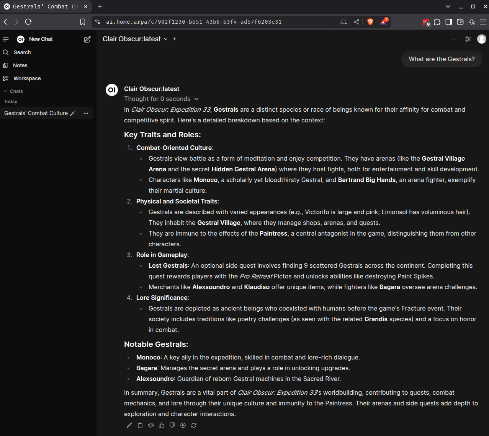

# FANDOM RAG #

I was working through some ideas for a project I could build to incorporate RAG into my homelab AI/LLM environment.  I recently have been playing Clair Obscur - and I had come across the fandom wiki for the game while i was looking up strategy guides.  Since it was a new game the local models I was using were not aware of Clair Obscur - so i thought it would be a good project to leverage the data on the [Clair Obscur Wiki](https://clair-obscur.fandom.com/wiki/Clair_Obscur_Wiki) so i can query my local LLMs for ideas on how to play the game.   The content of the fandom wikis was published under the [creative commons](https://www.fandom.com/licensing) license, so i am pretty sure i can use the content like this without getting into any trouble!

My plan broke down the project into the following steps:

1) Download all of the pages from the wiki
2) Convert the content of the pages into a format appropriate for the LLM (either markdown or text)
3) Chunk the content of each page (with overlap) and calculate embedding data for each chunk
4) Store the embedding data, the text content of the chunk and relevant meta-data for the article in a vector database
5) Collect a prompt from a user, calculate embeddings for that prompt, and then retrieve the most relevant/similar chunks from the vector database
6) Construct a prompt for my local LLM which combines the users prompt as a question, along with - as context - the relevant chunks from the vector database.  I wanted to get the best quality answers possible, so I maximized the number of chunks i provided to the context ; but ensured I did not exceed the context window used by my back end LLM service (ollama)
7) Test and validate the approach above with some simple shell scripts, and once i was happy with the behavior - make everything generic so instead of only being able to run for the clair obscur wiki, it would work for any fandom wiki at all. 
8) Build a wrapper around the entire process - a service that would expose the functionality as an api for the RAG workflow to be accessed from my OpenWeb UI instance.

```mermaid
flowchart TD
    A[1. Download all wiki pages] --> B[2. Convert pages to LLM-friendly format]
    B --> C[3. Chunk content & calculate embeddings]
    C --> D[4. Store embeddings, text, and metadata in vector DB]
    D --> E[5. Collect user prompt, calculate prompt embeddings, retrieve similar chunks]
    E --> F[6. Construct LLM prompt with user question and relevant chunks]
    F --> G[7. Test and validate workflow, generalize for any fandom wiki]
    G --> H[8. Build API service for RAG workflow (OpenWebUI integration)]
```

This project is implemented with python scripts.  To get started, clone this repo, create a virtual environment and install the requirements with pip.

```
git clone https://github.com/thefnordling/fandom-rag.git
cd fandom-rag
python3 -m venv .venv
source ./venv/bin/activate
pip install -r requirements.txt
```

I have some hard-coded references in the scripts to urls like my homelab ollama server.  I will make these variables at some point in the future - if you're playing around since my homelab is not exposed to the internet, you'll need to update the addresses/endpoints (and model names) to what is appropriate for your environment.

## Scraping Fandom (Step 1) ##

I started out using the requests library with a custom user agent header, but quickly got myself rate limited by fandom.  So I switched from requests to playwright, which worked much better.  To reduce the risk of rate limiting or getting my ip blocked - i did not load the pages in parallel, and I added a bit of delay in between each download.  This meant that downloading large wikis will take a few hours; so if I expand this tool more, i will parameterize the script with some some minimal partitioning and download the partitions in parallel to better balance load times and keep a low risk of rate limiting.

to scrape the wiki, run the `scrape_fandom_wiki.py` script, specifying the wiki subdomain.  For example to scrape the Clair Obscur wiki at https://clair-obscur.fandom.com/wiki/Clair_Obscur_Wiki you can pass the subdomain `clair-obscur` to the script like so:

```
python scrape_fandom_wiki.py clair-obscur
```

The script will use the fandom api at https://clair-obscur.fandom.com/wiki/Clair_Obscur_Wiki to first pull the list of all articles, and then iterate through that list to download each article individually saving the data to a jsonl file.   There is minimal error handling in place in the script, just a few retries.

### Converting the articles to LLM friendly format (Step 2) ###

I needed to convert the HTML retreived from the wiki into a format that the LLM can understand - either plain text or markdown.  I started out trying to do this with a library called [docling](https://github.com/docling-project/docling).   I had really high hopes for docling, however after performing the conversions and spot checking the results - too much of the content was omitted from the docling output ; docling considered a lot of the content "furniture" not really material even though it was important.  I could have done some pre-proccessing of the HTML using the css tags fandom provided in order to get a better output from docling - however I really just wanted to frame up a RAG integration so decided to take a simpler route for now - using BeautifulSoup to convert from html to plain text.

The `scrape_fandom_wiki.py` script will create a file with one line per page containing json payload with the following information (i split it into multiple lines to improve readability here, in the file this would all be on one line)
```
{
    "title": "the title of the page or article",
    "url": "the url of the page",
    "html": "the html content of the article - note that <html> <head> and <body> tags are not present"
    "text": "the text extracted from the html via beautiful soup"
}
```

I plan to revisit this later on, to test other libraries like [html2text](https://pypi.org/project/html2text/) or [pandoc](https://pandoc.org/)

## Cleaning up Stub Articles ##

after reviewing the content of the json payload, i noticed a number of articles seemed to be placeholders denoting them as stubs to be later fleshed out by users.  I did not want these stubs to make it into my RAG database so i made a simple script that will remove those stub articles.  Running this is optional, and if other wikis use a different stub template the matching conditions may need to be updated.

```
python remove_stub_articles.py clair-obscur.jsonl
```

## Selecting an LLM ##

I have an 8bit quant of Qwen3-32b that i think produces great general-use output.  It's large enough to give me confidence that it will run well without too much hallucination, and it's also small enough that I should be able to run both it and my embedding model in vram concurrently.

I will be hosting the GGUF model on ollama.

## Selecting an Embedding Model ##

The next steps in the process will require chunking the text of the articles, calculating embeddings for the chunks and storing the data in a vector database.  

The heart of this operation is the embedding calculations.  They embeddings will be used to determine similarity of a chunk to the users question - so getting them right is the most important part of the process.

There are a lot of models that can be used to produce embeddings.  The choice of embedding model can be made independently of the choice of the LLM because the embedding calculation for the users question and the chunks, as well as the comparison beetween them used to sort and select the RAG inputs to the LLM - all happens outside of the LLM.

For this project, my priority was getting the best answers from the RAG integration - so i was fine exchanging some convenience and incurring longer processing times to get better results - but i still had to check a few things before finalizing on my choice

* Can the embedding model fit in VRAM simultaneously with my LLM
* Is my vector database able to support the embedding dimensions produced by embedding model
* as the database grows in size will i have performance problems if the dimensions of my embeddings are too large
* do i need to index my vector database - are the dimensions of the embeddings compatible with my database
* Is my expected chunk size within the limits of the embedding sequence length

the method i used to select the embedding model was straight forward - i picked the best performing open source embedding model on the [hugging face MTEB leaderboard](https://huggingface.co/spaces/mteb/leaderboard).   I selected [Qwen/Qwen3-Embedding-8B](https://huggingface.co/Qwen/Qwen3-Embedding-8B) - it was second place overall - a great place for an open source model.

### Embedding Comparison - dot product or cosine similarity ###

an important thing to note is that some embeddings will calculate weighted values - where the values in the aray are floats between -1 and 1.  embedding models that do this should use the [dot product](https://en.wikipedia.org/wiki/Dot_product) - not the cosine similarity to compare values.  The huggingface documentation for Qwen3-Embedding-8B showed using cosine similarity to compare the model outputs - so that is how i knew to use cosine similarity instead of dot product in my script.

### Testing the Embedding Model ###

Qwen3-Embedding-8B will produce a 4096 array for the embeddings.  This is a lot of data, not something that the human eye could make any sense of.  But i still wanted to test it out before i built this whole integration around it.   My thought was to generate embeddings for similar, and dis-similar words, phrases and sentences - and then verify if the embeddings indicated that the dis-similar elements were less similar than the similar elements were.

as a simple test, i wanted to compare the cosine similarity of "apple" and "pear" with the cosine similarity of "apple" and "turtleneck".  To me, fruits are more similar to other fruits than they are to shirts - i expect to get a cosine similarity much closer to 1 for apple and pear than with apple and turtleneck.

the script `embedding_compare.py` will take two words/phrases/sentences, calculate the embeddings for them and then calculate the [cosine similarity](https://en.wikipedia.org/wiki/Cosine_similarity) of the two embeddings.

```
❯ python embedding_compare.py apple pear
Cosine similarity: 0.949409

❯ python embedding_compare.py apple turtleneck
Cosine similarity: 0.344371

❯ python embedding_compare.py "the capital of france" "paris"
Cosine similarity: 0.677936

❯ python embedding_compare.py "the capital of france" "nice"
Cosine similarity: 0.343956
```

so this quick test showed the embeddings are doing a reasonable job showing more similarity between more similar items

## Setting up the Vector Database ##

There are lots of good vector databases available.  I chose to use postgres with the pgvector extension.  This is definitely _not_ an ideal choice (i will explain more below) - but i had a postgres server already running in the environment and had all the necessary management tools set up as well; so I chose to use postgres for this phase of the project.

I was running postgres in a container.  Postgres does not come with pgvector out of the box so i needed to install it before i could enable the extension.   To do this I created a custom postgres image (thefnordling/postgres:16) that bundled in the extension (as well as some bits and bobs needed in my local environment)

```
# Use mixins image as a build stage to copy scripts
FROM docker.io/thefnordling/mixins:latest AS mixins

FROM postgres:16

# Install pgvector from the official PostgreSQL APT repo
RUN apt-get update && \
    apt-get install -y curl jq postgresql-16-pgvector && \
    apt-get clean && \
    rm -rf /var/lib/apt/lists/*

# Copy scripts from mixins image
COPY --from=mixins /mixins/scripts/load-env-from-secrets.sh /load-env-from-secrets.sh
COPY --from=mixins /mixins/scripts/add-ca-certs.sh /add-ca-certs.sh

ENV VAULT_ADDR=https://vault.home.arpa
# Install certificates once during build time
RUN /add-ca-certs.sh && update-ca-certificates
```

Most of the Dockerfile is some generic bootstrapping for all the services in my homelab - adding trust for my root ca and adding support for injecting docker secrets.  The only bit that's critical here is the apt-get install of `postgresql-16-pgvector `.

### Creating the Database & Database Users ###

After updating my postgres instance to use the new image, i was ready to set up a database to store the embeddings, enable vectors and create users to manage the data.

in the `db/` folder there is a script `pg_init.sh` which when run will:

1) create the specified database to store our RAG data
2) create a user the rag tools can use to insert and later retreive the data
3) enable the vector extension in the database
4) create tables to store the articles, and the chunked article content
5) ensure permissions for the user are properly set up

Run the script to set things up.  the arguments in braces fill in what is appropraite for your environment, for example {my_db_server} in my homelab is db.home.arpa

In a production environment never pass secrets via the command line.

```
./db/pg_init.sh {my_db_server} {my_pg_admin_user} {my_pg_admin_user_password} {my_rag_db_name} {my_rag_user} {my_rag_user_password}
```

### Limitations of Postgres ###

If you had reviewed the scripts, you may have noticed we did not create any indices on the embedding column in the chunks table.  This will mean querying on the embeddings will be relatively expensive.  This was the main sacrifice i made when choosing postgres.  Postgres vector indices are limited to 2k dimensions.  The reason for this is that postgres uses an 8k page size.  An index on a 4096 dimension vector just wouldnt' fit in 8k.   If I had recompiled postgres to use a larger page size, and customized or recompiled the pgvector extension and building an image from all that so i could actually use those larger indices - i would no longer have general-purpose postgres service (which was the main benefit of using pgvector in the first palce).  

So - i decided that if i needed a true vector-optimized database, i would move off of postgres and onto pinecone or supabase or something else in the future; for now i will accept the slower query time.  With the wiki content i was using there would only be a few 10k or 100k records and i didn't expect tables that small would have a query time that would make the RAG workflow unacceptable.

## Chunking Article Content and Saving to Postgres (Steps 3 & 4) ##

The script `chunk_embed_insert.py` will be taking the data from our JSONL file and saving it to postgres.  

1) we will pull database connection details from command line arguments, as well as the jsonl file to load
2) we will iterate over each line in the JSONL file and for each row in the file
    1) we will insert a record for the article into pg - containing the title of the article as well as some meta data
    2) we will then split the article content into chunks, and for each chunk we will
        1) ensure the chunk has a healty overlap with the next chunk
        2) any tiny chunks will get appended to the prior chunk (chunks too small may not be processed well by the LLM)
        3) calculate the embeddings for the chunk using the `Qwen/Qwen3-Embedding-8B` model
        4) store the embeddings, the article content of the chunk as well as some metadata into the chunks table

I wasn't sure how taxing on the GPU the embedding calculations would be, so i processed the rows serially.  I could optimize this more by partitioning the articles into a number of sets that my GPU could handle in parallel - but i will leave that optimization for later.

run the script by passing all the necessary arguments on the command line:

```
python chunk_embed_insert.py --db-host {my_db_server} --db-name {my_rag_db_name} --db-user {my_rag_user} --db-pass {my_rag_user_password} --input-file clair-obscur-no-stubs.jsonl
```

this process will take a while.  Clair Obscur was loaded in maybe 30minutes, but the pokemon wiki had to run overnight.

The logic i'm using in this script is pretty basic - i plan to revisit this in the future and use [langchain](https://python.langchain.com/docs/concepts/text_splitters/) - however before that i will need to improve the html to text extraction (so probably switch off of beautiful soup first, then update the chunking approach)


## The RAG Query (steps 5, 6 & 7) ##

The script `rag_query.py` will be the test of the overall integration.  This script will

1) retrieve database connection details from the command line arguments
2) retrieve the users query from the command line arguments
3) use ollama to calculate embeddings for the query
4) use postgres to find the chunks most relevant to the query
    * the script we ran above, to test our embedding logic, calcualted cosine similarity; which produces values closer to 1 for more similar items.  Instead of cosine similarity, our pgvector query is using cosine distance (the `<=>` operator) which as a distance operator returns values closer to 0 for more similar.  
5) compose a prompt to send to the llm using as many chunks as we can fit into our LLMs context window (the more information we can give to the LLM the better our answers should be)
    * a future improvement could be querying ollama for the context size and makign  the model be user selectable.
6) submit the prompt to the ollama API and return the results to the user.

To run this script pass the database connection, wiki and query details to the script via the command line

```
python rag_query.py --db-host {my_db_server} --db-name {my_rag_db_name} --db-user {my_rag_user} --db-pass {my_rag_user_password} \
    --wiki 'Clair Obscure' --query "Who is Renoir's Wife"
```

## OpenWebUI Integration (Step 8) ##
There is a built-in way (using the knowledge feature) to support RAG in OpenWeb UI.  Details are [here](https://docs.openwebui.com/tutorials/tips/rag-tutorial/).  To set that up, we would export the article text we converted during our scraping - after Step 2, and used that as the knowledge base.

However, the goal of this project wasn't to learn how to use OpenWebUI - it was to learn RAG.  So I did all this instead, to be hands on controlling all the logic and the steps scraping, chunking, embedding, vector database operations, model selections, building RAG context and prompts - the whole works.  So for production use of OpenWeb UI - definitely follow the steps in their RAG tutorial.

To close the loop on this integration, we will expose our RAG operations to OpenWebUI so we can give our end users a GUI.   We will do that by mocking up an ollama API that calls back to our RAG script and returns results of the users query to OpenWeb UI.   I have implemented that in two scripts

1) `uvicorn_wrapper.py`  This script will take command line arguments and set them as environmental variables that can be read in via our FastAPI (which will be run from uvicorn).  This isn't necessary but since we used command line arguments everywhere else in this project I thought i should use them here for consistancy.
2) `rag_api.py` this is a FastAPI server that reports our Fandom Wiki as an LLM models, letting users add those models to OpenWebUI for querying.  Chatting with the models will provide the last chat message in the OpenWebUI provided context to our rag_query.py script, which will be returned (syncronously, no streaming) back to openwebui.

To get started, run the uvicorn_wrapper script, specifying the database connection details

```
python uvicorn_wrapper.py --db-host {my_db_server} --db-name {my_rag_db_name} --db-user {my_rag_user} --db-pass {my_rag_user_password}
```

this will run our FastAPI at `0.0.0.0:8000`.  You can adjsut this (if needed) by also providing `--host` and `--port` arguments on the command line.

From OpenWeb UI, go to the admin panel, then go into settings and add a new Connection.  In my homelab, the name of my gpu workstation is fnordstation so i added the connection as `http://fnordstation.home.arpa:8000`.   After adding the connectionm, I hit the `manage` icon, and put `Clair Obscure` ito the "Pull a Model" field, and then hit the `download` icon.  

Users can then interrogate my RAG API via OpenWeb UI Chats!  and we're done!  

